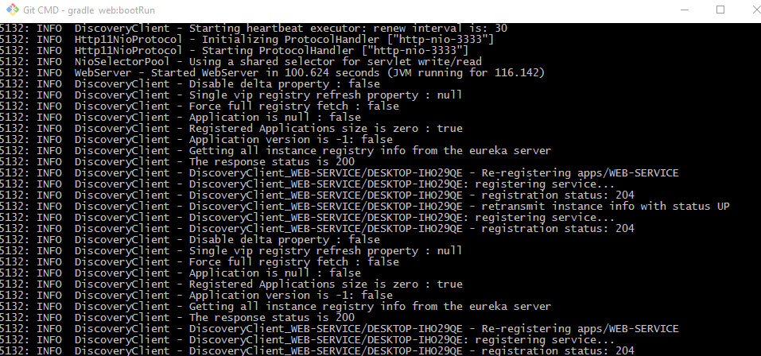
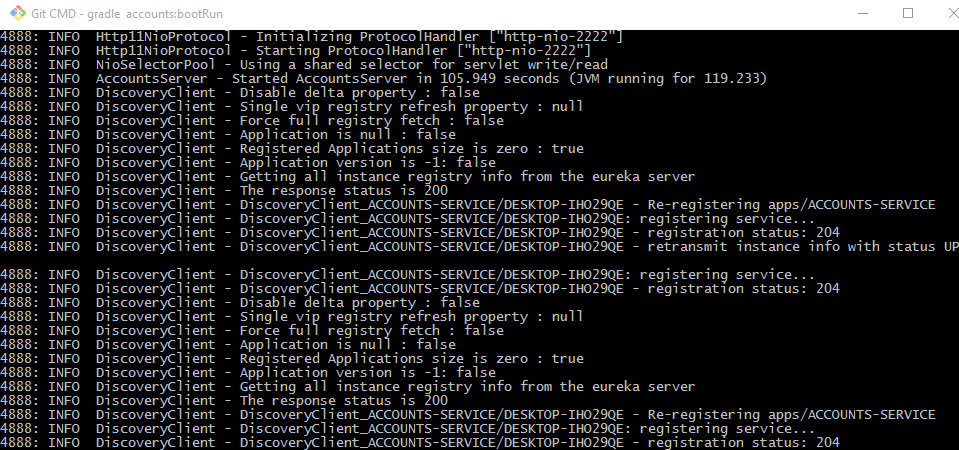
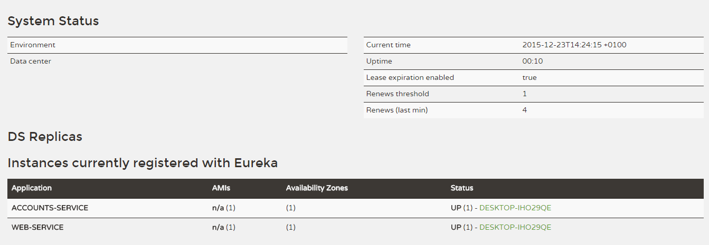
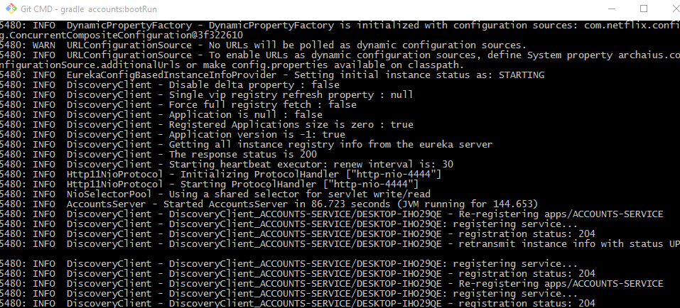

# Web Engineering 2015-2016 / Microservices
Please, go to the [Wiki](https://github.com/UNIZAR-30246-WebEngineering/Laboratory-6-microservices/wiki) in order to get the instructions for this assignment.

## The two microservices are running and registered

## The service registration service has the two microservices registered

## A second account microservice is running in the port 4444 and it is registered

## A brief report describing what happens when you kill the microservice with port 2222. Can the web service provide information about the accounts? Why?

When someone kill the accounts service in port 2222 the registration service detects that another accounts service is up so the service continues working
